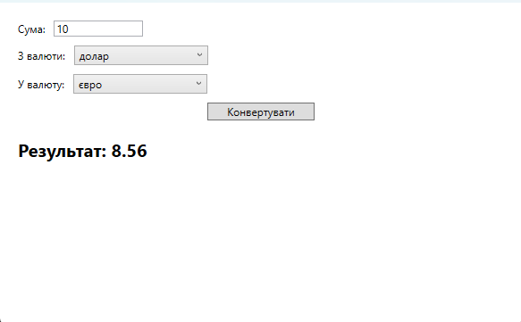

# CurrencyConverter

A WPF MVVM application that allows users to convert currencies using a live API. It also connects to a local database containing a custom dictionary mapping currency codes to more human-readable informal names.

## Features

- Real-time currency conversion
- Custom dictionary (code → informal name) for better UX
- Built with MVVM pattern
- Uses API + SQLite database

## Technologies

- WPF (.NET 6+)
- MVVM
- REST API
- SQLite via Entity Framework Core

## About the Dictionary

The local database contains currency code pairs such as:
USD → US Dollar
UAH → Ukrainian Hryvnia
JPY → Japanese Yen
This allows users to recognize currencies by familiar names rather than ISO codes.

## Screenshots

Main currency conversion window:

